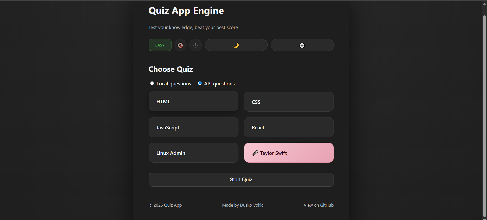

# React Quiz App

A modern, feature-rich **quiz application built with React**, focused on clean architecture, state management, and testability.

## Features

- **Feature-based project architecture** for scalable and maintainable code
- **Zustand state management** with sliced store logic
- **Settings panel** for runtime configuration and feature toggles
- **Progress bar** indicating quiz completion and real-time quiz tracking
- **Timer per question** with automatic timeout handling
- **Retry mode** for incorrectly answered questions only
- **Sound effects** (optional)
- **Light / Dark theme** with persistent user preference saved in `localStorage`
- **Statistics tracking** across quiz sessions
- **Unit tests** for store logic and UI behavior



---

## Demo

Live demo: [https://react-quiz-engine.netlify.app/](https://react-quiz-engine.netlify.app/)

---

## Table of Contents

- [Quiz App](#quiz-app)

  - [Demo](#demo)
  - [Table of Contents](#table-of-contents)
  - [Features](#features)
  - [Technologies Used](#technologies-used)
  - [Project Structure](#project-structure)
  - [Getting Started](#getting-started)
  - [Prerequisites](#prerequisites)
  - [How to Run](#how-to-run)
  - [Usage](#usage)
  - [Built with](#built-with)
  - [Contributing / Support](#contributing--support)
  - [Author](#author)
  - [License](#license)
  - [Acknowledgments](#acknowledgments)

---

## Features

### Quiz Flow

Start → answer questions → view results with score and statistics.

### Timer

Optional timer per question.
When time runs out, the question is automatically marked as incorrect.

### Retry Mode

Retry only previously incorrect questions to improve weak areas.

### Settings

- Enable / disable sound
- Enable / disable timer
- Adjust time per question
- Set number of questions per quiz
- Select difficulty level

### Statistics

- Best score
- Accuracy tracking
- Last result summary
- Weak questions tracking

### Theme

Toggle between light and dark mode.
User preference is saved in `localStorage`.

---

## Technologies Used

- React
- Vite
- Zustand
- Vitest
- React Testing Library
- JavaScript (ES6+)
- Local Storage for persistence

---

## Project Structure

The project follows a feature-based folder structure:

```

src/
├─ components/
│  ├─ header/
│  ├─ footer/
│  ├─ question/
│  ├─ settings/
│  ├─ progress/
│  ├─ pages/
├─ store/
│  ├─ slices/
│  │  ├─ quizSlice.js
│  │  ├─ settingsSlice.js
│  │  ├─ statsSlice.js
│  │  └─ uiSlice.js
│  └─ useQuizStore.jsx
├─ styles/
│  ├─ base/
│  ├─ layout/
│  ├─ components/
│  └─ index.css
├─ utils/
├─ main.jsx
└─ App.jsx

(Some utility and adapter files omitted for brevity.)

```

State management is split into dedicated Zustand slices:

- UI
- Settings
- Quiz logic
- Statistics

---

### Getting Started

These instructions will get you a copy of the project up and running on your local machine for development and testing purposes.

---

### Prerequisites

What things you need to install the software and how to install them:

- Node.js (LTS recommended)
- npm

---

### How to Run Locally

1. Clone the repository.
2. Install dependencies:

```Bash
npm install
```

3. Start the development server:

```Bash
npm run dev
```

---

## Usage

1. Start a new quiz from the start screen.
2. Answer questions manually or let the timer expire.
3. Track progress using the progress bar.
4. Open settings to adjust quiz behavior.
5. View results and statistics at the end of the quiz.
6. Retry incorrect questions to improve performance.

---

### Question Sources

The quiz can operate using:

- Local question data (default)
- External API source (via adapter layer)

The data source can be toggled via settings without affecting quiz logic.

---

## Testing

The project includes unit tests for:

1. Zustand store logic
2. Timer behavior
3. QuestionCard interactions

Run tests with:

```Bash
npm test
```

## Built With

- [React](https://react.dev/) - UI library
- [Vite](https://vitejs.dev/) - Build tool
- [Zustand](https://zustand-demo.pmnd.rs/) - State management
- [Vitest](https://vitest.dev/) - Unit testing framework

---

## Contributing / Support

- Contributions are welcome. Feel free to open an issue or submit a pull request.
- For problems or suggestions, please use GitHub issues.

---

## Author

This project is maintained by Duško Vokić.
You can reach out via:

- GitHub: https://github.com/D-vokic
- Website: https://duskovokic.com

---

## License

This project is licensed under the MIT License.

---

## Acknowledgments

- React community for best practices and tooling
- Zustand for lightweight state management
- Vitest for fast and reliable testing
